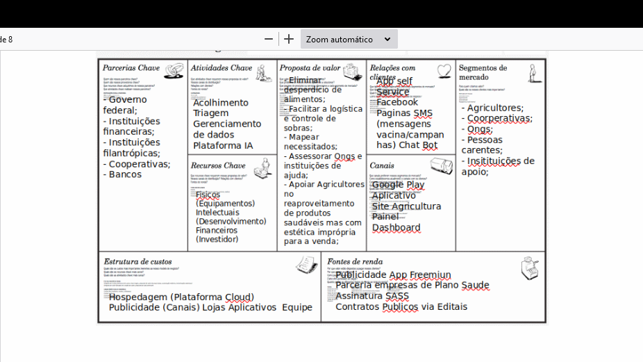

# Kultive

Kultive is an app that provides information about climate to farmers. This allows farmers to be able to work better on top of their plantations considering weather changes, risks such as fire and frost risks, so that they can make a better strategy for how their planting will be done until harvest time.

